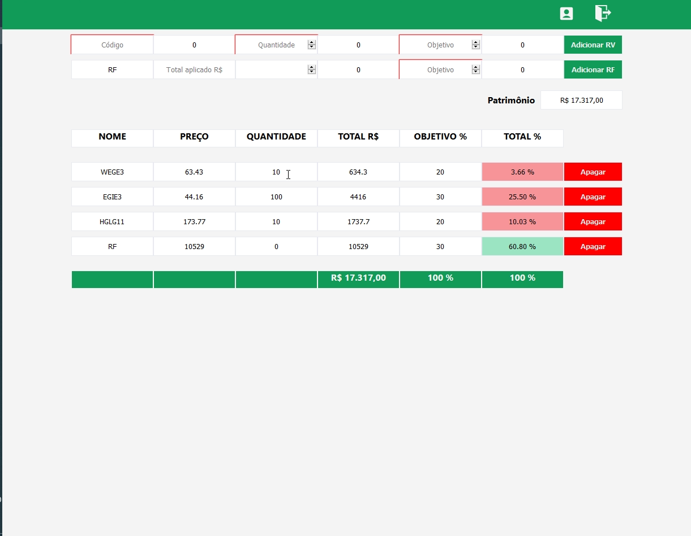
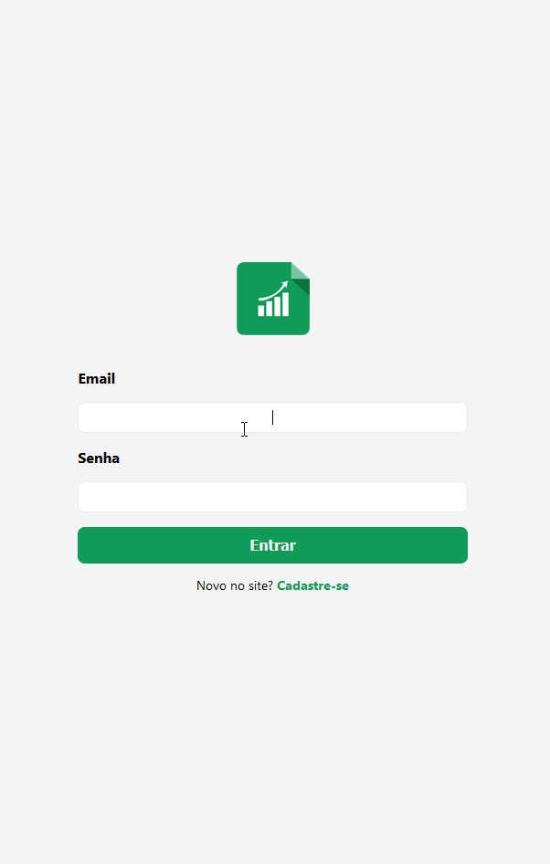

<h1 align="center">
 
  
 
 
Portfolio rebalance
</h1>

Site para controlar os novos aportes em ativos do mercado financeiro brasileiros

  
  

## Tecnologias
Tecnologias usadas no projeto.

- **Node.js**
- **Express**
- **Axios**
- **Mysql**
- **Sequelize**
- **Nodemailer**
- **ReactJS**
- **Web Scraping**

## Começando

1. Clone o repositório `git clone https://github.com/Iago-s/investiment-portfolio.git`
2. Vá para a pasta criada `cd investiment-portfolio`

## Iniciando o backend
1. Entre na pasta `cd backend`
2. Instale as dependências `npm install`
3. Execute o backend `npm dev`

## Iniciando o frontend
1. Entre na pasta `cd frontend`
2. Instale as dependências `npm install`
3. Execute o backend `npm start`
